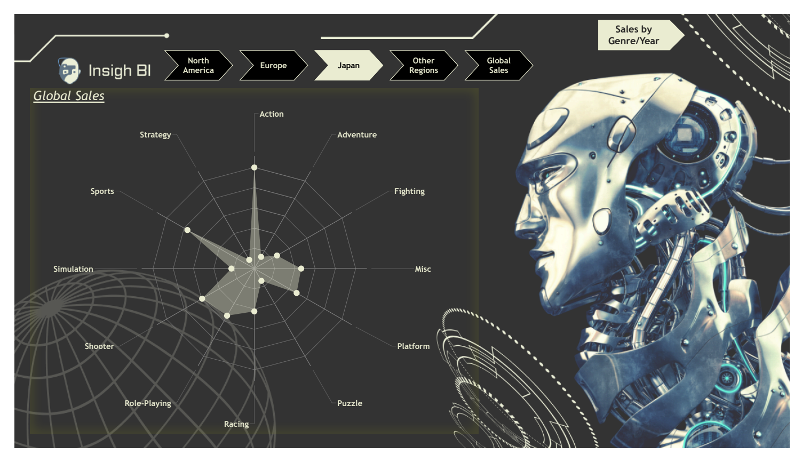
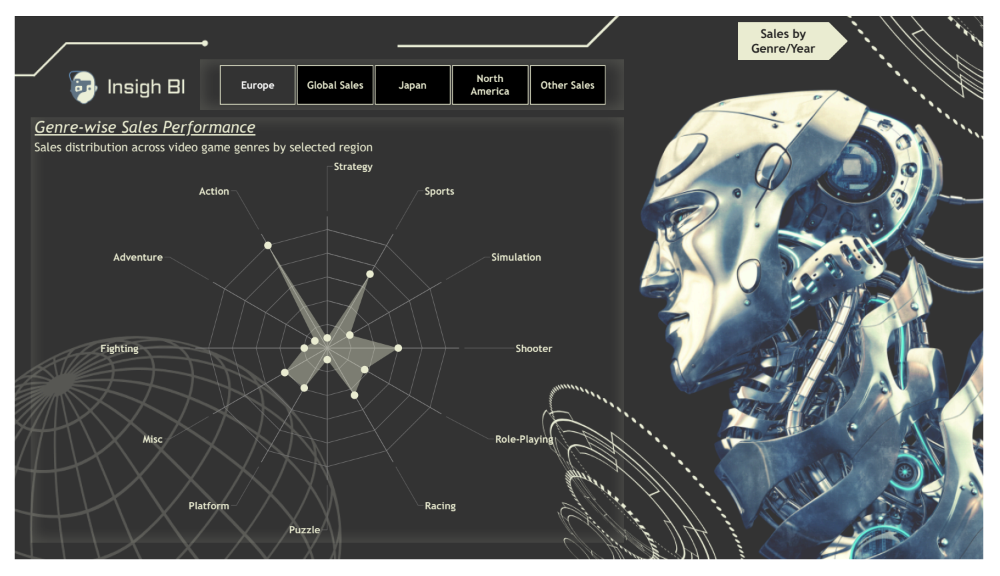
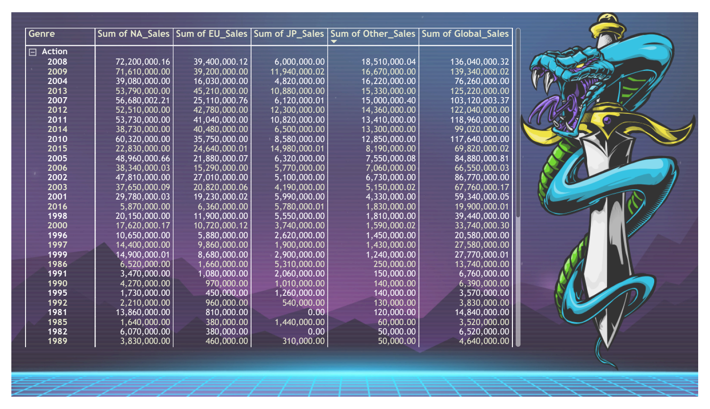
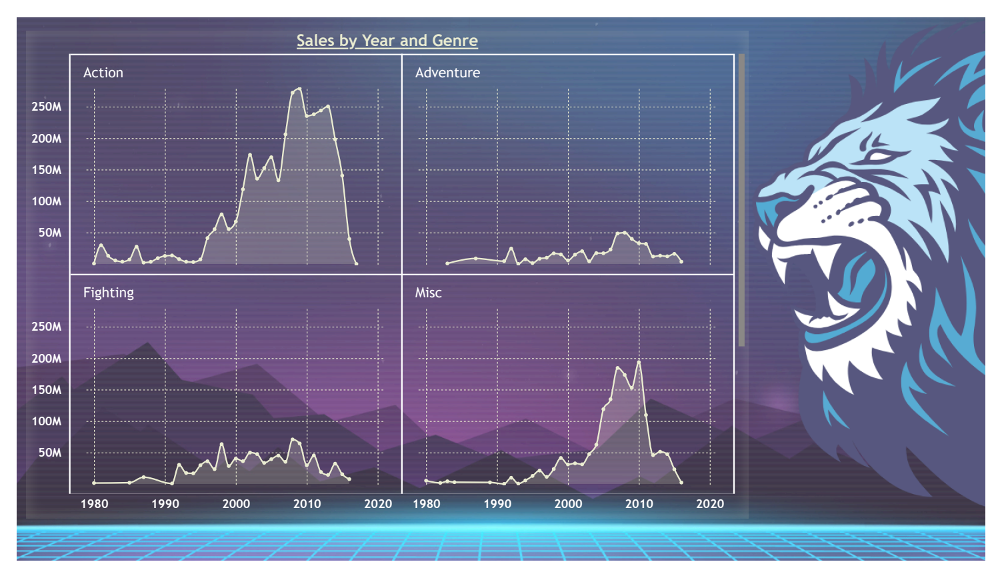

# Video Games Sales Analysis
Power BI | AWS Athena | SQL | Data Visualization

## Project Summary
This project analyzes global video game sales data across multiple regions and genres to uncover sales trends, regional performance, and genre popularity over time.

The dashboard is designed to help business stakeholders and analysts understand market dynamics and make data-driven decisions related to product strategy and regional focus.

### Business Objectives
- Analyze video game sales trends across different regions
- Identify top-performing genres globally and region-wise
- Compare North America, Europe, Japan, and Other Regions sales
- Understand year-over-year sales patterns
- Enable interactive exploration using bookmarks, slicers, and navigation

### Data Source
- Primary Dataset: Video Games Sales (CSV)
- Cloud Storage: AWS S3
- Query Engine: Amazon Athena
- Data Access: ODBC (Simba Athena Connector)

### Tools & Technologies
- Power BI Desktop & Power BI Service
- AWS S3
- Amazon Athena
- AWS Glue
- ODBC Connector
- SQL
- Power Query (ETL)
- DAX

### Data Preparation & Modeling
- Imported data from Amazon Athena and CSV
- Appended multiple datasets into a single final table
- Handled:
	- Missing and null values
	- Incorrect year values
	- Data type corrections
- Converted regional sales figures into standardized monetary values for accurate comparison
- Applied data normalization and transformations
- Built two analytical approaches:
	- Bookmark-based navigation
	- Slicer-based dynamic filtering

### Dashboard Highlights
- Interactive radar charts comparing genre performance across regions
- Year-over-year sales trend analysis using line charts
- Genre and year-level breakdown with matrix visuals
- Region-based navigation using Power BI bookmarks
- Dynamic filtering for deeper exploratory analysis

## How to Use the Dashboard
- Use the top navigation buttons to switch between regions (Global, North America, Europe, Japan, Other)
- Hover over visuals to view detailed tooltips
- Use genre and year filters to explore trends dynamically
- Compare sales patterns across regions using radar charts
- Analyze long-term trends using year-wise line charts

## Report Screenshots (Power BI)

### Radar Chart – Global Sales by Genre

### Radar Chart – Regional Sales by Genre

### Sales by Genre and Year (Matrix View)

### Sales Trends Over Time (Line Charts)

### Key Insights
- Action and Sports genres dominate global sales
- North America contributes the highest sales volume
- Japan shows distinct genre preferences compared to other regions
- Sales peaked during specific years, followed by gradual decline
- Genre performance varies significantly across regions

### Outcome
This project demonstrates:
- Strong data modeling & ETL skills
- Experience with cloud-based analytics (AWS Athena)
- Ability to build interactive, business-ready dashboards
- Clear storytelling through visual analytics

## Skills Demonstrated
- Data Analysis & Visualization
- SQL & Cloud Analytics (AWS Athena)
- Power BI Dashboard Design
- Data Cleaning & Transformation (ETL)
- DAX Calculations
- Analytical Storytelling

## Data Ethics & Disclaimer
This project uses a publicly available video game sales dataset for educational and portfolio purposes only.  
No personal or sensitive user data was used in this analysis.

